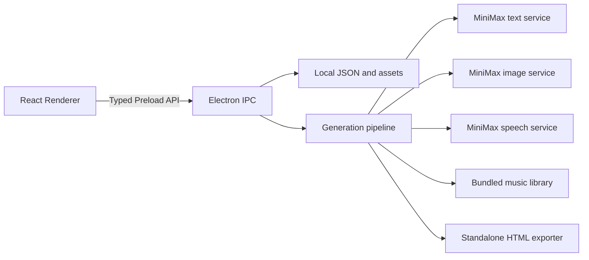

# 架构说明

## 系统边界



应用采用 Electron 主进程、受限 Preload 桥接和 React Renderer 三层结构。Renderer 不直接访问 Node.js、文件系统或凭据；所有持久化、远端请求和本地资源读取都经过类型化 IPC。

## 目录

```text
src/
  main/
    providers/          文本、图像和语音服务适配器
    security/           凭据保存与导航策略
    services/           生成流水线、音频合并和 HTML 导出
    storage/            项目、音色、任务和媒体持久化
    index.ts             Electron 生命周期与资源协议
    ipc.ts               受信 Renderer IPC
  preload/              最小类型化桥接
  renderer/             React 用户界面
  shared/               合同、schema、音色、画风、曲库和模板
resources/               应用图标与 20 首内置背景音乐
scripts/                 资源生成、平台打包和 R2 发布
tests/                   单元测试与集成测试
website/                 Vite 静态官网
```

## 数据模型

`StoryProject` 保存故事来源、孩子显示信息、章节范围、篇幅、绘画风格、音色、背景音乐和当前制作状态。生成结果按项目目录保存正文清单、插图、章节朗读、背景音乐和内部 HTML。

`STORY_TEMPLATES` 是 Renderer 可直接读取的静态模板目录。模板一次性填充主题、情节、章节、篇幅、绘画风格和建议配乐，不覆盖孩子昵称、年龄或朗读音色。

系统音色使用应用内稳定编号保存，远端 Voice ID 只在主进程白名单中解析。在线复刻音色保存授权样本路径、远端 Voice ID、创建时间和服务地址绑定信息。

## 制作流水线

1. 校验项目、音色、服务配置和在线额度。
2. 校验系统音色，或上传已授权样本并准备在线复刻音色。
3. 生成或整理故事结构，校验章节数量、篇幅和场景拼接。
4. 从内置曲库复制用户选择的背景音乐；未选择时跳过。
5. 按统一的画风设定逐章生成插图。
6. 按连续情绪场景合成 44.1 kHz 单声道章节朗读。
7. 插入场景过渡静音并合并章节 WAV。
8. 生成内部 HTML，并在用户确认后导出独立文件。

`GenerationJob` 持久化步骤、百分比、单位数、消息和预计时间。Renderer 同时监听 IPC 事件并定期刷新快照，失败后可从已经完成的步骤继续。

## 本地媒体

内置音乐通过共享注册表映射到固定 ASCII 文件名。`story-asset://` 协议只允许项目媒体、授权录音、系统音色试听缓存和注册表中的内置曲目，主进程会同时校验项目范围、编号和真实路径。

独立 HTML 将正文、图片、章节朗读和可选背景音乐内嵌为单文件，不引用远端资源。页面 CSP 只允许必要的 data/blob 媒体和经过哈希约束的脚本。

播放器使用原生 `<audio>` 输出章节人声，背景音乐单独接入 Web Audio 增益节点，实现音量控制和朗读期间自动压低。iPhone 与 iPadOS 使用设备侧边键控制人声音量；其他平台保留网页音量控制。

## 安全

- `SecretStore` 使用 Electron `safeStorage` 加密 API Key，并将凭据绑定到目标服务 Origin。
- IPC 校验 sender、mainFrame、受信 URL 和 Zod 输入 schema。
- 远端服务地址必须使用 HTTPS；只有 loopback 开发端点可以使用 HTTP。
- 在线复刻要求成年人、授权和在线处理范围三项明确确认。
- 导出 HTML 不包含 API Key、创作草稿、内部提示词或原始录音。
- Electron 启用上下文隔离、Renderer 沙箱、导航拦截和受限权限。

## 构建与发布

Electron Builder 生成 Windows x64 NSIS 安装包和 macOS Apple Silicon arm64 DMG。安装包通过 `extraResources` 附带应用图标、许可证、第三方声明、负责任使用说明和内置背景音乐。

`scripts/build-release.mjs` 在对应操作系统执行完整构建并校验产物名称。`scripts/upload-release.mjs` 使用 R2 S3 兼容接口上传两个平台的版本化安装包和 `latest` 别名，并生成 `website/public/downloads.json`。

官网使用独立 Vite 工程构建到 `website/dist/`，由 Cloudflare Pages 监听 `main` 分支部署。
